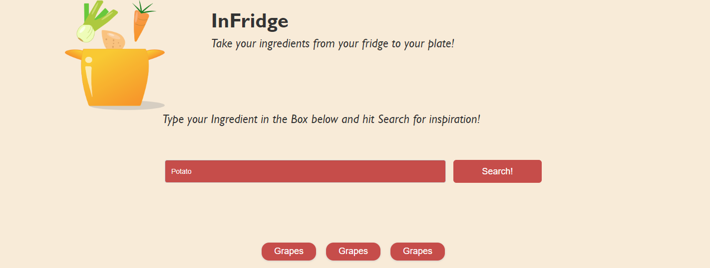
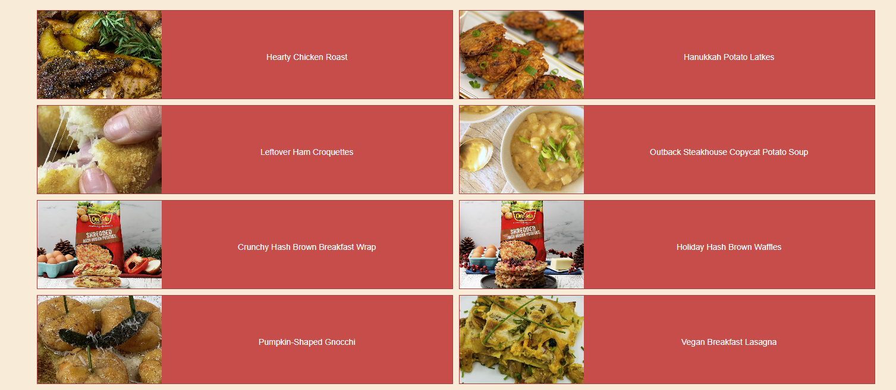
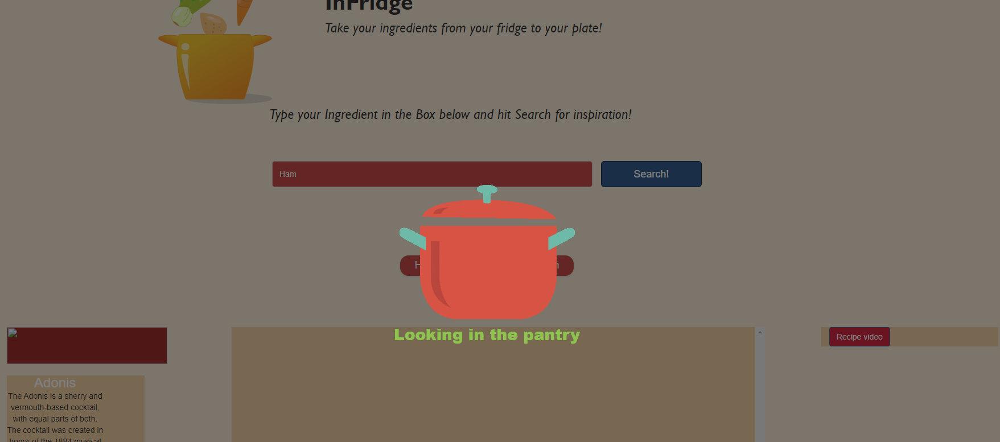
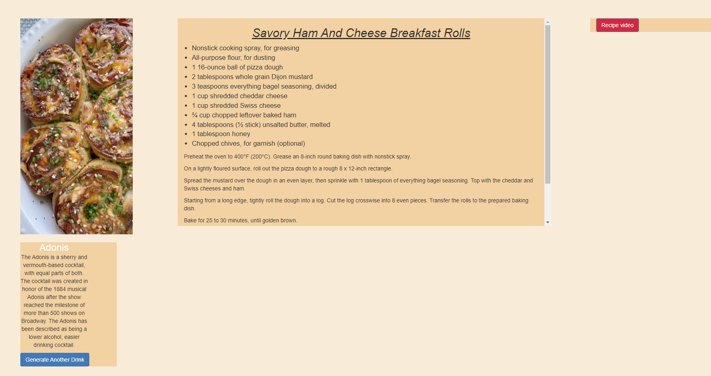
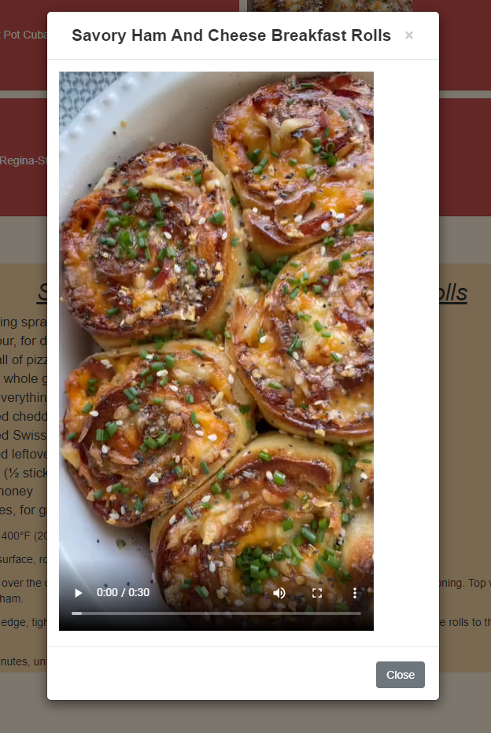
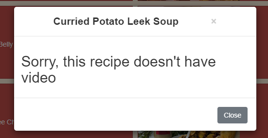

# InFridge Recipe Generator

## Description

This project was our group's first opportunity to work on a coding project collaboratively, it's been a fantastic opportunity to become beter rehearsed with using github branches and pull requests, as well as the github projects page. 

The deployed application itself was built on the idea of inspiring the user to try new, exciting recipes that they have never tried before, and basing the recipe suggestions on an ingredient of their choice - maybe something they always have in the fridge, ready to use. We wanted to build an easy to navigate interface that would provide the user with multiple options for dishes to give them variety, and on their chosen recipe - give them all the information and visual guidance necessary to make the dish. We also chose to include a drink API that generates a random drink recipe on the meal recipe page, giving the user more exciting recipes to try.

The project required the use of multiple API's - which came with their own challenges - such as figuring out the multiple endpoints and query url parameter requirements. We also used a mixture of dynamic JQuery html generation and standard HTML,CSS builds to create the recipe results and information. The application also utilises the users local storage to record their most recent three ingredient searches (which are pushed to the landing page on load). The biggest challenge - which has also been very rewarding, has been learning to divide and work on tasks as a group.

## Table of Contents

- [Installation](#installation)
- [Usage](#usage)
- [Credits](#credits)
- [License](#license)

## Installation

The deployed application can be viewed via this [link](https://spooky-pictures.github.io/InFridge/)

## Usage

On load the page will display as follows:  

  

This is the application landing page, on load, the user can see the application's logo, title, subheading, as well as an ingredient search bar. The users previous searches are also pulled from local storage and pushed to the page, as shown below the search bar in the image above.

The user can type in an ingredient name and hit search, which will then send a query to the Tasty API. This will return 8 recipe's which will show as cards on the screen, as shown below:  

  

Whilst the API is loading the following loading GIF is shown on screen:  

  

The user can then select a recipe of their choice from the list, which will then load all the recipe information - name of recipe, ingredients, method at the bottom of the screen. The Recipe page also loads in a second API (bottom right) that will suggest a random cocktail to the user, to inspire them for a drink. The page also loads a recipe video in a modal:  

  

The Recipe video button when clicked will open the recipe video:  

  

If no video is in the API - as is sometime the case, this message will show instead:  

You can test some ideal pathways by searching for "Leek" then selecting "Winter Vegetable Gratin" to see a working video example.

## Credits

- Collaborators:  
[David](https://github.com/Davvid96)  
[Dumisile](https://github.com/DumisileM)  
[Elvis](https://github.com/NukeTurtle)  
[Daniel](https://github.com/danielpsnz)  
[Emma](https://github.com/EmH93)  

- Resources Used:  
[Tasty API](https://rapidapi.com/apidojo/api/tasty)  
[Drinks Digital API](https://rapidapi.com/SaaSDev/api/drinks-digital1/)  
[Bootstrap CSS and HTML](https://getbootstrap.com/docs/4.6/getting-started/introduction/)  

## License

MIT License
